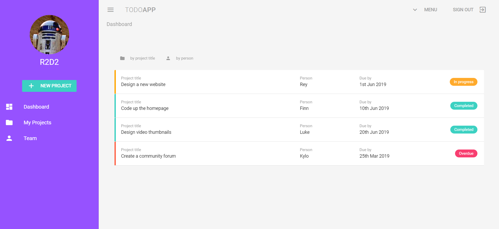

# A simple project management app

A few years ago, I built a web app at work with a C# .NET backend and a plain HTML, CSS, JavaScript frontend. I used good ol' jQuery and Bootstrap to make my website look "fancy". And IMO it looked pretty good! I may be a tiny bit biased :stuck_out_tongue_closed_eyes: But to be honest, compared to the many enterprise web applications we used, it was a game changer.
    
Then, one day, a friend sent me this article: [How it feels to learn JavaScript in 2016.](https://hackernoon.com/how-it-feels-to-learn-javascript-in-2016-d3a717dd577f) Here is a quote:

> "Oh my god no, no one uses jQuery anymore. You should try learning React, it’s 2016." :sweat_smile:

Once I read that, I naturally had to find out what all these modern frontend frameworks were all about. 
However, I decided not to pick React (or Angular). 
Instead, I chose the new kid on the block [Vue.js](https://vuejs.org/), mainly because it had a lower learning curve (I wasn't planning on making a career out of it after all). 
What attracted me was the ability to use standard JavaScript (so I didn't need to learn any new languages) and that there is no setup required to get started. 
You can simply try it out by grabbing Vue from CDN and include it in your HTML file!

Given that I was still new to web development, I was already amazed by all the things you could achieve with jQuery. 
But when I first saw two-way binding in action, my mind was blown!
So of course I wanted to explore more.

## Frontend

I've built a simple project management app using Vue and [Vuetify](https://vuetifyjs.com/en/), a material design component framework.
This exercise is designed more around demonstrating Vuetify's component than it is functional.
Nevertheless, it was a great learning experience for me.

_Screenshot of the end result_

All credits go to [The Net Ninja](https://twitter.com/thenetninjauk) who put together [this awesome tutorial](https://www.youtube.com/playlist?list=PL4cUxeGkcC9g0MQZfHwKcuB0Yswgb3gA5) going through the core features of Vuetify.
He also has a [video series on Vue](https://www.youtube.com/playlist?list=PL4cUxeGkcC9gQcYgjhBoeQH7wiAyZNrYa) that I highly recommend.
So be sure to check out his YouTube channel!

## Backend
Coming soon... 

I'm thinking of creating a backend using [FastAPI](https://fastapi.tiangolo.com/) and [Postgres](https://www.postgresql.org/), but haven't made my decision yet.

## Contact
If you have any questions or suggestions for improving my code, [reach out to me here](https://twitter.com/rtm010) and I'll be more than happy to have a chat :smiley: 
